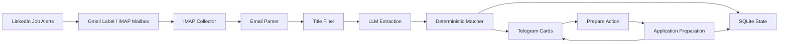

# Job Applier

Job Applier is a local CLI service that reads LinkedIn Job Alert emails via IMAP, parses vacancy cards from email content (without scraping LinkedIn pages), evaluates fit using LLM extraction plus deterministic Python matching, sends relevant roles to Telegram, and helps prepare an application package (cover letter + selected resume). It tracks Skip/Prepare/Applied states in SQLite, while final submission on LinkedIn or external ATS remains manual.

## Main Features

- Continuous background mode via `uv run python -m app run`.
- LinkedIn Job Alert ingestion from mailbox labels/folders through IMAP.
- Structured vacancy parsing from email HTML with safe fallbacks.
- Hybrid evaluation: LLM extracts structured facts; deterministic matcher makes final scoring/decision.
- Telegram delivery with inline actions (`Skip`, `Prepare`, `Applied`, `Open LinkedIn`).
- Cover letter generation and resume selection for requested applications.
- Telegram resume caching by reusable `file_id` (first upload, then reuse).
- SQLite state tracking for deliveries, statuses, and operational offsets.
- Debug commands for visibility and safe local state correction.

## Architecture



The LLM is used to extract structured vacancy information. Final scoring and decisioning are done by deterministic Python logic.

## End-to-End Workflow

1. LinkedIn sends job alert emails.
2. Job Applier reads the configured IMAP folder/label.
3. Vacancy cards are parsed and normalized.
4. The evaluator computes `STRONG_MATCH`, `POTENTIAL_MATCH`, or `IGNORE`.
5. Relevant cards are sent to Telegram.
6. You can mark cards as `Skip`, `Prepare`, or later `Applied`.
7. On `Prepare`, Job Applier generates the cover letter, picks resume, sends package to Telegram, and updates status.
8. Final application submission remains manual.

## Requirements

- Windows, macOS, or Linux.
- Python 3.13+.
- [uv](https://docs.astral.sh/uv/) for dependency and command execution.
- IMAP mailbox access for LinkedIn alerts (Gmail supported).
- OpenAI-compatible LLM endpoint.
- Telegram bot and private chat.

## Quick Start

1. Clone repository.
2. Create environment file:

```powershell
copy .env.example .env
```

3. Install dependencies:

```powershell
& "C:\Users\<USER>\.local\bin\uv.exe" sync
```

or if `uv` is in `PATH`:

```powershell
uv sync
```

4. Run tests:

```powershell
& "C:\Users\<USER>\.local\bin\uv.exe" run pytest
```

or:

```powershell
uv run pytest
```

5. Start background service:

```powershell
& "C:\Users\<USER>\.local\bin\uv.exe" run python -m app run
```

or:

```powershell
uv run python -m app run
```

Never commit real secrets in `.env`.

## Configuration Reference

| Variable | Required For | Example | Description | Secret |
|---|---|---|---|---|
| `LLM_API_URL` | All LLM-based analysis | `https://api.openai.com/v1` | Base URL for OpenAI-compatible API | No |
| `LLM_API_KEY` | All LLM-based analysis | `sk-***` | API key for LLM provider | Yes |
| `LLM_MODEL` | All LLM-based analysis | `gpt-4o-mini` | Model identifier for extraction and cover letter generation | No |
| `HH_USER_AGENT` | `collect-hh` | `job-applier/0.1 contact@example.com` | User-Agent for HH API requests | No |
| `LINKEDIN_EMAIL_IMAP_HOST` | LinkedIn email collection | `imap.gmail.com` | IMAP host | No |
| `LINKEDIN_EMAIL_IMAP_PORT` | LinkedIn email collection | `993` | IMAP port | No |
| `LINKEDIN_EMAIL_USERNAME` | LinkedIn email collection | `you@example.com` | IMAP login username/email | Potentially |
| `LINKEDIN_EMAIL_PASSWORD` | LinkedIn email collection | `xxxx xxxx xxxx xxxx` | IMAP password (for Gmail use app password, not account password) | Yes |
| `LINKEDIN_EMAIL_FOLDER` | LinkedIn email collection | `LinkedIn Jobs` | IMAP mailbox/label name | No |
| `LINKEDIN_EMAIL_SEARCH_DAYS` | LinkedIn email collection | `7` | Lookback window in days | No |
| `LINKEDIN_EMAIL_MARK_AS_READ` | LinkedIn email collection | `false` | Mark processed emails as read | No |
| `TELEGRAM_BOT_TOKEN` | Telegram integration | `123456:ABC...` | Bot API token from BotFather | Yes |
| `TELEGRAM_CHAT_ID` | Telegram integration | `123456789` | Target private chat ID | Potentially |
| `RESUMES_DIR` | Preparation pipeline | `resumes` | Directory with local resume PDFs | No |
| `CANDIDATE_PREFERRED_LANGUAGE` | Cover letter generation | `en` | Preferred language when vacancy language is ambiguous | No |
| `CANDIDATE_GRAMMATICAL_GENDER` | RU cover letter grammar | `neutral` | Gender setting used for language checks | No |
| `PIPELINE_INTERVAL_SECONDS` | `run` service | `300` | Main collection/send cycle interval | No |
| `TELEGRAM_POLL_INTERVAL_SECONDS` | `run` service | `2` | Callback polling interval | No |
| `LINKEDIN_EMAIL_IMAP_USERNAME` | Documentation compatibility | `you@example.com` | Legacy name used in old notes; actual variable is `LINKEDIN_EMAIL_USERNAME` | Potentially |
| `LINKEDIN_EMAIL_IMAP_PASSWORD` | Documentation compatibility | `xxxx xxxx xxxx xxxx` | Legacy name used in old notes; actual variable is `LINKEDIN_EMAIL_PASSWORD` | Yes |

## Gmail and LinkedIn Job Alerts Setup

### Gmail (IMAP + label routing)

1. Enable Google 2-Step Verification.
2. Create a Google App Password.
3. In Gmail, create a filter for LinkedIn Job Alert emails.
4. Apply label `LinkedIn Jobs`.
5. Set in `.env`: `LINKEDIN_EMAIL_FOLDER=LinkedIn Jobs`
6. Verify mailbox names:

```bash
uv run python -m app list-imap-folders
```

7. Preview parsed vacancies:

```bash
uv run python -m app preview-linkedin-email
```

Gmail labels are exposed as IMAP mailboxes.

### LinkedIn Job Alerts

1. Confirm the desired notification email in LinkedIn settings.
2. Create several Job Alerts (daily frequency recommended).
3. Configure relevant regions and remote filters.
4. Wait for first alert emails to arrive in Gmail label/folder.

Suggested alert queries:

- Java Backend
- Java Spring Boot
- Kotlin Backend
- JVM Backend
- Java Kafka

This project reads LinkedIn alert emails only; it does not scrape LinkedIn pages and does not log into LinkedIn.

## Telegram Bot Setup

1. Open [@BotFather](https://t.me/BotFather).
2. Run `/newbot` and create bot.
3. Put token into `TELEGRAM_BOT_TOKEN`.
4. Send at least one message to your bot from your private account.
5. Resolve chat ID:

```bash
uv run python -m app telegram-chat-id
```

6. Put value into `TELEGRAM_CHAT_ID`.
7. Dry run card generation:

```bash
uv run python -m app send-linkedin-telegram --dry-run --limit 3
```

8. Real send:

```bash
uv run python -m app send-linkedin-telegram --limit 3
```

Buttons and statuses:

- `❌ Skip` -> `SKIPPED`
- `Подготовить отклик` / prepare action -> `PREPARE_REQUESTED`
- prepared package sent -> `PREPARED`
- `✅ Applied` -> `APPLIED`
- `🔗 Open LinkedIn` opens job page, does not change status

## Resume Setup

Expected local files:

- `resumes/java-backend.pdf`
- `resumes/kotlin-backend.pdf`
- `resumes/fintech-backend.pdf`
- `resumes/ai-adjacent-backend.pdf`

Notes:

- Resume files stay local.
- Resume identifiers map to these filenames.
- Missing PDF does not block cover-letter generation.
- PDFs may include personal data and should be ignored by git.
- Keep optional placeholder file: `resumes/.gitkeep`.
- Telegram upload caching:
  - first send uploads local PDF and stores Telegram `file_id`;
  - next sends reuse `file_id` without uploading bytes;
  - if local PDF changes (mtime/size), cache is invalidated and file uploads again.
- Resume cache only optimizes Telegram delivery from this local app; final upload/selection in LinkedIn or ATS stays manual.

## Running the Background Service

Start:

```bash
uv run python -m app run
```

The service:

- runs collection + analysis on `PIPELINE_INTERVAL_SECONDS`;
- polls Telegram callbacks on `TELEGRAM_POLL_INTERVAL_SECONDS`;
- processes `PREPARE_REQUESTED` items automatically;
- exits cleanly on `Ctrl+C`;
- prevents duplicate instances with `data/job_applier.lock`.

Example logs:

- `[09:10] LinkedIn: 3 new vacancies`
- `[09:10] Telegram: 2 cards sent`
- `[09:11] Prepare request received`
- `[09:11] Application generated`
- `[09:11] Resume sent`

## Manual Commands

See detailed table in [`docs/COMMANDS.md`](docs/COMMANDS.md).

Primary commands:

- `review`
- `collect-hh`
- `collect-linkedin-email`
- `preview-linkedin-email`
- `list-imap-folders`
- `send-linkedin-telegram`
- `telegram-chat-id`
- `poll-telegram-actions`
- `prepare-telegram-applications`
- `telegram-cache-resumes`
- `telegram-resume-cache`
- `telegram-clear-resume-cache`
- `telegram-debug`
- `telegram-reset`
- `telegram-delete-delivery`
- `run`

## Quick Command Reference

For daily practical usage, see [`docs/CHEATSHEET.md`](docs/CHEATSHEET.md).

Use [`docs/COMMANDS.md`](docs/COMMANDS.md) as the complete technical reference.

## Status Lifecycle

Primary path:

`SENT` -> `PREPARE_REQUESTED` -> `PREPARED` -> `APPLIED`

Alternative states:

- `SKIPPED`
- `FAILED`
- `PREPARATION_FAILED`

See transition details in [`docs/COMMANDS.md`](docs/COMMANDS.md).

Resume cache commands:

```bash
uv run python -m app telegram-cache-resumes
uv run python -m app telegram-resume-cache
uv run python -m app telegram-clear-resume-cache java-backend
```

## Troubleshooting

Common operational issues and fixes are in [`docs/TROUBLESHOOTING.md`](docs/TROUBLESHOOTING.md).

## Security and Privacy

Security and privacy practices are documented in [`docs/SECURITY.md`](docs/SECURITY.md).

## Known Limitations

- LinkedIn alert emails may include incomplete vacancy descriptions.
- Location eligibility often requires manual verification.
- Final application submission is manual.
- External ATS forms and flows vary by company.
- LLM extraction can vary slightly across similar inputs.
- HeadHunter API availability may produce `403` depending on conditions.
- Service targets a single configured private Telegram chat.

## Development and Tests

- Run tests: `uv run pytest`
- Format: `uv run ruff format .`
- Lint: `uv run ruff check .`

Coverage focuses on behavior-level scenarios: parser robustness, deterministic matching, Telegram actions, preparation workflow, scheduler/loop behavior, and failure recovery.

## Project Structure

```text
app/
  collectors/
  application/
  storage/
  telegram/
  cli.py
docs/
  ARCHITECTURE.md
  COMMANDS.md
  TROUBLESHOOTING.md
  SECURITY.md
profiles/
prompts/
tests/
data/
```

## Roadmap

- Better multi-source vacancy ingestion.
- Improved location/work-authorization reasoning.
- More customizable ranking and notification policies.
- Better multi-chat Telegram support and role-based controls.
- Optional web UI for operational visibility.
