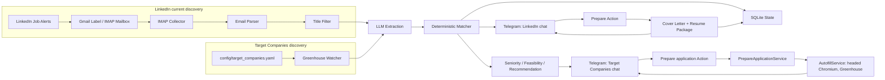

# Job Applier

Job Applier is a local automation service with two parallel discovery paths — LinkedIn Job Alert emails read via IMAP ("current discovery") and a configured list of Target Companies' Greenhouse boards — both evaluated with LLM extraction plus deterministic Python matching and delivered to Telegram. For LinkedIn vacancies it helps prepare an application package (cover letter + selected resume) that you submit yourself. For Target Company Greenhouse vacancies it can additionally open a real headed browser, fill known application fields and upload your resume (Stage 1 autofill), and then wait for you to review and submit manually — the app never clicks Submit itself. It tracks lifecycle state (SENT / PREPARED / APPLIED / SKIPPED / …) in SQLite; final submission on LinkedIn or any external ATS always remains a manual, human action.

## Main Features

- Continuous background mode via `uv run python -m app run`.
- LinkedIn Job Alert ingestion from mailbox labels/folders through IMAP ("current discovery").
- Structured vacancy parsing from email HTML with safe fallbacks.
- Optional generic Greenhouse collector (`collect-greenhouse`, `GREENHOUSE_BOARDS`) delivered through the same LinkedIn/current-discovery Telegram destination.
- Target Companies discovery from `config/target_companies.yaml`: a dedicated Greenhouse watcher, plus standalone Lever/Ashby/SmartRecruiters watchers that exist but are **not yet wired into `run` or Telegram**. Workday is not implemented.
- Hybrid evaluation for every source: LLM extracts structured facts; a deterministic matcher makes the final `STRONG_MATCH` / `POTENTIAL_MATCH` / `IGNORE` decision. Target Companies additionally get a deterministic seniority/feasibility pass and an `APPLY_NOW` / `CHECK_MANUALLY` / `SKIP` application recommendation.
- Two separate Telegram destinations: LinkedIn/current-discovery chat and a dedicated Target Companies chat (`TELEGRAM__TARGET_COMPANIES_CHAT_ID`) with no silent fallback between them.
- LinkedIn cards: `Skip` / `Prepare` (cover letter + resume package, delivered back to Telegram) / `Applied` / `Open LinkedIn`.
- Target Company Greenhouse cards: `Prepare application`, which runs Stage 1 Greenhouse autofill in a real headed Chromium browser — deterministic identity/eligibility/professional fields plus resume upload and, when possible, a generated cover letter — then leaves the browser open for you to review and submit yourself.
- A diagnostic-only CLI, `autofill SOURCE EXTERNAL_ID`, runs the same Stage 1 autofill directly, bypassing recommendation/lifecycle gating.
- Telegram resume caching by reusable `file_id` (first upload, then reuse).
- SQLite state tracking for deliveries, application lifecycle, and operational offsets.
- Debug commands for visibility and safe local state correction.

## Architecture


```mermaid
flowchart LR
    subgraph LinkedIn current discovery
        A[LinkedIn Job Alerts] --> B[Gmail Label / IMAP Mailbox]
        B --> C[IMAP Collector]
        C --> D[Email Parser]
        D --> E[Title Filter]
    end
    subgraph Target Companies discovery
        TC[config/target_companies.yaml] --> TW[Greenhouse Watcher]
    end
    E --> F[LLM Extraction]
    TW --> F
    F --> G[Deterministic Matcher]
    G --> RC[Seniority / Feasibility / Recommendation]
    G --> H[SQLite State]
    G --> I1[Telegram: LinkedIn chat]
    RC --> I2[Telegram: Target Companies chat]
    I1 --> J[Prepare Action]
    J --> K[Cover Letter + Resume Package]
    K --> I1
    K --> H
    I2 --> P[Prepare application Action]
    P --> PA[PrepareApplicationService]
    PA --> AF[AutofillService: headed Chromium, Greenhouse]
    AF --> I2
```

The LLM is used to extract structured vacancy information and to write cover letters on both paths (LinkedIn `PreparationService`, and Target Company Greenhouse autofill via `AutofillCoverLetterProvider`); it may also draft optional answers for unknown Greenhouse custom questions, always flagged for review. Final scoring, matching, recommendation, and known-field mapping/classification are made by deterministic Python logic — the known-field mapper is deterministic, but not every value an autofill run places into the form is, since cover letters and generated custom-question answers come from the LLM. The LLM never decides whether or what to submit, and nothing in either path clicks Submit.

## End-to-End Workflow

### LinkedIn / current discovery

1. LinkedIn sends job alert emails.
2. Job Applier reads the configured IMAP folder/label.
3. Vacancy cards are parsed and normalized.
4. The evaluator computes `STRONG_MATCH`, `POTENTIAL_MATCH`, or `IGNORE`.
5. Relevant cards are sent to the LinkedIn Telegram chat.
6. You can mark cards as `Skip`, `Prepare`, or later `Applied`.
7. On `Prepare`, Job Applier generates the cover letter, picks a resume, sends the package to Telegram, and updates status to `PREPARED`.
8. Final application submission remains manual. `Applied` is a button you press yourself after you submit — the app does not detect or verify a real LinkedIn/ATS submission.

### Target Companies (Greenhouse)

1. The Greenhouse watcher fetches vacancies for each Greenhouse company listed in `config/target_companies.yaml`.
2. The same LLM extraction + deterministic matcher runs, plus a seniority/feasibility pass, producing `APPLY_NOW`, `CHECK_MANUALLY`, or `SKIP`.
3. Eligible cards are sent to the separate Target Companies Telegram chat.
4. Tapping **Prepare application** calls `PrepareApplicationService` (blocks vacancies already `APPLIED`; blocks `SKIP`; requires an explicit tap for `CHECK_MANUALLY`), which calls `AutofillService`.
5. `AutofillService` opens the Greenhouse application URL in a real headed Chromium window, fills the fields it can answer deterministically from your structured Candidate Profile, uploads your resume, and — when an LLM client is configured — fills a generated cover letter and, for eligible unknown professional questions, a short generated answer (always marked `generated` and flagged for manual review, never auto-submittable). Sensitive/demographic fields (gender, ethnicity, disability, veteran status, etc.) are left unfilled by default; a required Gender question specifically always gets a non-disclosure option and never reads `sensitive.gender`, even with no explicit configuration, while an optional Gender question is always left untouched. Required questions that remain unresolved (no deterministic fact, not LLM-eligible, or generation failed) are reported for manual completion, not guessed.
6. A completion message with a **Done reviewing** button is sent to Telegram once filling finishes; the browser stays open until you tap it (or the process shuts down). Tapping it only closes that specific browser session — it never submits the form and never changes application status.
7. You review the filled form yourself and click Submit in the browser if you want to apply. Job Applier does not verify with the ATS that a submission actually went through.
8. There is no automatic `Applied` for this path yet; tap the Telegram card's `✅ Applied` action once you have actually submitted — it updates both the canonical `application_history` lifecycle and the Telegram delivery status. `telegram-reset` is a debug tool that only rewrites `telegram_deliveries` (Telegram card UI status); it does not touch `application_history`, so it is not equivalent to tapping `✅ Applied`.

## Requirements

- Windows, macOS, or Linux.
- Python 3.13+.
- [uv](https://docs.astral.sh/uv/) for dependency and command execution.
- IMAP mailbox access for LinkedIn alerts (Gmail supported).
- OpenAI-compatible LLM endpoint.
- Telegram bot and private chat.
- Playwright Chromium (`uv run playwright install chromium`), only needed for Greenhouse Stage 1 autofill (`autofill` command / Target Companies "Prepare application").

## Quick Start

1. Clone repository.
2. Create environment file:

```powershell
copy .env.example .env
```

3. Install dependencies:

```powershell
& "C:\Users\<USER>\.local\bin\uv.exe" sync
```

or if `uv` is in `PATH`:

```powershell
uv sync
```

4. Run tests:

```powershell
& "C:\Users\<USER>\.local\bin\uv.exe" run pytest
```

or:

```powershell
uv run pytest
```

5. Start background service:

```powershell
& "C:\Users\<USER>\.local\bin\uv.exe" run python -m app run
```

or:

```powershell
uv run python -m app run
```

Never commit real secrets in `.env`.

## Configuration Reference

| Variable | Required For | Example | Description | Secret |
|---|---|---|---|---|
| `LLM_API_URL` | All LLM-based analysis | `https://api.openai.com/v1` | Base URL for OpenAI-compatible API | No |
| `LLM_API_KEY` | All LLM-based analysis | `sk-***` | API key for LLM provider | Yes |
| `LLM_MODEL` | All LLM-based analysis | `gpt-4o-mini` | Model identifier for extraction and cover letter generation | No |
| `HH_USER_AGENT` | `collect-hh` | `job-applier/0.1 contact@example.com` | User-Agent for HH API requests | No |
| `LINKEDIN_EMAIL_IMAP_HOST` | LinkedIn email collection | `imap.gmail.com` | IMAP host | No |
| `LINKEDIN_EMAIL_IMAP_PORT` | LinkedIn email collection | `993` | IMAP port | No |
| `LINKEDIN_EMAIL_USERNAME` | LinkedIn email collection | `you@example.com` | IMAP login username/email | Potentially |
| `LINKEDIN_EMAIL_PASSWORD` | LinkedIn email collection | `xxxx xxxx xxxx xxxx` | IMAP password (for Gmail use app password, not account password) | Yes |
| `LINKEDIN_EMAIL_FOLDER` | LinkedIn email collection | `LinkedIn Jobs` | IMAP mailbox/label name | No |
| `LINKEDIN_EMAIL_SEARCH_DAYS` | LinkedIn email collection | `7` | Lookback window in days | No |
| `LINKEDIN_EMAIL_MARK_AS_READ` | LinkedIn email collection | `false` | Mark processed emails as read | No |
| `TELEGRAM_BOT_TOKEN` | Telegram integration | `123456:ABC...` | Shared Bot API token from BotFather | Yes |
| `TELEGRAM__CHAT_ID` | Telegram integration | `123456789` | Legacy LinkedIn/discovery chat ID; fallback for `TELEGRAM__LINKEDIN_CHAT_ID` (the flat form `TELEGRAM_CHAT_ID`, without the nested-settings `__` delimiter, is not a `Settings` key) | Potentially |
| `TELEGRAM__LINKEDIN_CHAT_ID` | Telegram LinkedIn flow | `123456789` | Chat ID for LinkedIn/current discovery messages | Potentially |
| `TELEGRAM__TARGET_COMPANIES_CHAT_ID` | Telegram Target Companies flow | `987654321` | Chat ID for Target Companies messages; no silent fallback to LinkedIn | Potentially |
| `RESUMES_DIR` | Preparation pipeline | `resumes` | Directory with local resume PDFs | No |
| `CANDIDATE_PREFERRED_LANGUAGE` | Cover letter generation | `en` | Preferred language when vacancy language is ambiguous | No |
| `CANDIDATE_GRAMMATICAL_GENDER` | RU cover letter grammar | `neutral` | Gender setting used for language checks | No |
| `PIPELINE_INTERVAL_SECONDS` | `run` service | `300` | Main collection/send cycle interval | No |
| `TELEGRAM_POLL_INTERVAL_SECONDS` | `run` service | `2` | Callback polling interval | No |
| `LINKEDIN_EMAIL_IMAP_USERNAME` | Documentation compatibility | `you@example.com` | Legacy name used in old notes; actual variable is `LINKEDIN_EMAIL_USERNAME` | Potentially |
| `LINKEDIN_EMAIL_IMAP_PASSWORD` | Documentation compatibility | `xxxx xxxx xxxx xxxx` | Legacy name used in old notes; actual variable is `LINKEDIN_EMAIL_PASSWORD` | Yes |

## Gmail and LinkedIn Job Alerts Setup

### Gmail (IMAP + label routing)

1. Enable Google 2-Step Verification.
2. Create a Google App Password.
3. In Gmail, create a filter for LinkedIn Job Alert emails.
4. Apply label `LinkedIn Jobs`.
5. Set in `.env`: `LINKEDIN_EMAIL_FOLDER=LinkedIn Jobs`
6. Verify mailbox names:

```bash
uv run python -m app list-imap-folders
```

7. Preview parsed vacancies:

```bash
uv run python -m app preview-linkedin-email
```

Gmail labels are exposed as IMAP mailboxes.

### LinkedIn Job Alerts

1. Confirm the desired notification email in LinkedIn settings.
2. Create several Job Alerts (daily frequency recommended).
3. Configure relevant regions and remote filters.
4. Wait for first alert emails to arrive in Gmail label/folder.

Suggested alert queries:

- Java Backend
- Java Spring Boot
- Kotlin Backend
- JVM Backend
- Java Kafka

This project reads LinkedIn alert emails only; it does not scrape LinkedIn pages and does not log into LinkedIn.

## Telegram Bot Setup

1. Open [@BotFather](https://t.me/BotFather).
2. Run `/newbot` and create bot.
3. Put token into `TELEGRAM__BOT_TOKEN`.
4. Send at least one message to your bot from your private account.
5. Resolve chat ID:

```bash
uv run python -m app telegram-chat-id
```

6. Put the LinkedIn/discovery chat ID into `TELEGRAM__LINKEDIN_CHAT_ID` (or keep using legacy `TELEGRAM__CHAT_ID`).
7. For Target Companies messages, put a chat ID into `TELEGRAM__TARGET_COMPANIES_CHAT_ID`. Do not omit it and expect LinkedIn channel fallback — the code raises a config error instead. It does not require this chat id to differ from the LinkedIn one, but using the same chat mixes both card types together.
8. Dry run card generation:

```bash
uv run python -m app send-linkedin-telegram --dry-run --limit 3
```

9. Real send:

```bash
uv run python -m app send-linkedin-telegram --limit 3
```

Buttons and statuses:

- `❌ Skip` -> `SKIPPED`
- `Подготовить отклик` / prepare action -> `PREPARE_REQUESTED`
- prepared package sent -> `PREPARED`
- `✅ Applied` -> `APPLIED`
- `🔗 Open LinkedIn` opens job page, does not change status

## Resume Setup

Resume variants are configured in `resume_profiles.yaml`. Each profile has an
identifier, a short description used by the resume selector, and the path to
its local PDF. Add another profile by adding another YAML entry; no code change
is required.

The default configuration expects:

- `resumes/java-backend.pdf`
- `resumes/ai-adjacent-backend.pdf`

Notes:

- Resume files stay local.
- The LLM selects a configured profile after vacancy analysis and before cover-letter generation.
- Invalid model selections fall back to the `java` profile.
- Missing PDF does not block cover-letter generation.
- PDFs may include personal data and should be ignored by git.
- Keep optional placeholder file: `resumes/.gitkeep`.
- Telegram upload caching:
  - first send uploads local PDF and stores Telegram `file_id`;
  - next sends reuse `file_id` without uploading bytes;
  - if local PDF changes (mtime/size), cache is invalidated and file uploads again.
- This resume cache is about Telegram delivery from `resume_profiles.yaml` (LinkedIn package flow / `send-linkedin-telegram`); it does not touch any ATS. Final submission on LinkedIn or an external ATS always stays manual — but Greenhouse Stage 1 autofill does automatically upload your `default_resume` (a separate file from the Candidate Profile YAML, see below) into the application form itself; only the final Submit click remains manual there.

## Target Companies (Greenhouse) Setup

1. List companies to watch in `config/target_companies.yaml` (Greenhouse-backed entries are watched today; `lever` / `ashby` / `smartrecruiters` / `custom` / `manual` entries are recognized by the config loader but have no watcher wired into `run` yet, except standalone Lever/Ashby/SmartRecruiters watcher modules that are not called from `run` or Telegram).
2. Set `TELEGRAM__TARGET_COMPANIES_CHAT_ID`; there is no fallback to the LinkedIn chat if it is unset. The code does not require this chat id to differ from the LinkedIn one, but using the same chat mixes both card types together.
3. Inspect discovery/analysis offline before enabling delivery:

```bash
uv run python -m app collect-target-companies-greenhouse --show-vacancies --limit 5
uv run python -m app analyze-target-companies-greenhouse --company Agoda
```

4. `run` delivers Target Companies cards automatically once `TELEGRAM__TARGET_COMPANIES_CHAT_ID` is set.

## Candidate Profile for Autofill

Greenhouse Stage 1's known-field mapper reads a separate, structured YAML profile, not `candidate_profile.md`, `profiles/`, `resume_profiles.yaml`, or `config/candidate_constraints.yaml` (those remain inputs to LLM matching and resume selection). The one exception is cover-letter generation: `AutofillCoverLetterProvider` reuses the shared LLM cover-letter generator and, when present, also loads `candidate_profile.md` as extra generation context alongside the structured YAML profile.

- `candidate_profile.example.yaml` — tracked in Git, synthetic/fake values, defines the schema.
- `candidate_profile.local.yaml` — gitignored, real values, overlaid on top of the example at runtime when present. Never read or committed by coding agents.

Sensitive/demographic fields (gender, ethnicity, disability, veteran status, etc.) are left unfilled by default. Gender specifically is never filled from `sensitive.gender`: a required Gender question always gets a non-disclosure option, and an optional Gender question is always left untouched, regardless of what the profile contains. Work authorization is per-country and explicit; a location alone never implies authorization or citizenship.

## Running the Background Service

Start:

```bash
uv run python -m app run
```

The service:

- runs collection + analysis on `PIPELINE_INTERVAL_SECONDS`;
- polls Telegram callbacks on `TELEGRAM_POLL_INTERVAL_SECONDS`;
- processes `PREPARE_REQUESTED` items automatically;
- exits cleanly on `Ctrl+C`;
- prevents duplicate instances with `data/job_applier.lock`.

Example logs:

- `[09:10] LinkedIn: 3 new vacancies`
- `[09:10] Telegram: 2 cards sent`
- `[09:11] Prepare request received`
- `[09:11] Application generated`
- `[09:11] Resume sent`

## Manual Commands

See detailed table in [`docs/COMMANDS.md`](docs/COMMANDS.md).

Primary commands:

- `review`
- `collect-hh` (HH collection stays CLI-only; not part of `run`)
- `collect-linkedin-email`
- `collect-greenhouse` (generic Greenhouse collector, separate from Target Companies)
- `collect-target-companies-greenhouse`
- `analyze-target-companies-greenhouse`
- `preview-linkedin-email`
- `list-imap-folders`
- `send-linkedin-telegram`
- `telegram-chat-id`
- `poll-telegram-actions`
- `prepare-telegram-applications`
- `autofill SOURCE EXTERNAL_ID` (diagnostic-only Stage 1 Greenhouse autofill; ungated, headed Chromium, terminal Enter/Ctrl+C to close)
- `telegram-cache-resumes`
- `telegram-resume-cache`
- `telegram-clear-resume-cache`
- `telegram-debug`
- `telegram-reset`
- `telegram-delete-delivery`
- `application-history`
- `application-stats`
- `run`

## Quick Command Reference

For daily practical usage, see [`docs/CHEATSHEET.md`](docs/CHEATSHEET.md).

Use [`docs/COMMANDS.md`](docs/COMMANDS.md) as the complete technical reference.

## Status Lifecycle

`application_history` is the single canonical lifecycle table, keyed by `(source, external_id)`, shared by both LinkedIn and Target Companies vacancies.

Primary LinkedIn path:

`SENT` -> `PREPARE_REQUESTED` -> `PREPARED` -> `APPLIED`

Alternative states:

- `SKIPPED`
- `FAILED`
- `PREPARATION_FAILED`

For Target Company Greenhouse vacancies, `PREPARE_REQUESTED`/`PREPARED` in this table refer to the LinkedIn-style package flow and are not produced by the Greenhouse "Prepare application" autofill path — running Stage 1 autofill and completing the browser review does not by itself write any lifecycle row. `APPLIED` is always a manual user action, normally the Telegram `✅ Applied` button (`app.cli`'s callback handler writes both `application_history` and `telegram_deliveries` together), never inferred from a successful autofill/read-back or from clicking Submit in the browser; the app never queries the ATS to confirm a submission actually happened. The `telegram-reset` CLI command only calls `TelegramDeliveryStorage.set_status`, which updates `telegram_deliveries` alone — it does not write `application_history` and so does not achieve the same lifecycle effect as the `✅ Applied` button. `PrepareApplicationService` reads `APPLIED` back as a hard gate: once a `(source, external_id)` is `APPLIED`, Prepare/autofill for it is blocked for every recommendation and intent (the diagnostic CLI `autofill` command is the only ungated path).

See transition details in [`docs/COMMANDS.md`](docs/COMMANDS.md).

Resume cache commands:

```bash
uv run python -m app telegram-cache-resumes
uv run python -m app telegram-resume-cache
uv run python -m app telegram-clear-resume-cache java-backend
```

Application history commands:

```bash
uv run python -m app application-history
uv run python -m app application-history --status APPLIED
uv run python -m app application-stats --days 30
```

## Troubleshooting

Common operational issues and fixes are in [`docs/TROUBLESHOOTING.md`](docs/TROUBLESHOOTING.md).

## Security and Privacy

Security and privacy practices are documented in [`docs/SECURITY.md`](docs/SECURITY.md).

## Known Limitations

- LinkedIn alert emails may include incomplete vacancy descriptions.
- Location eligibility often requires manual verification.
- Final application submission is always manual; the app never clicks Submit and never verifies a submission against the ATS.
- Greenhouse Stage 1 autofill fills fields it can answer deterministically from the structured Candidate Profile, plus resume upload and, when an LLM client is configured, a generated cover letter and short generated answers for eligible unknown professional questions (always marked `generated` and flagged for manual review, never auto-submittable); required questions that remain unresolved (no deterministic fact, not LLM-eligible, or generation failed) are reported for manual completion, not guessed.
- Only Greenhouse has an autofill adapter. Lever/Ashby/SmartRecruiters/Workday/custom/manual Target Companies are discovered or configured at most; there is no autofill for them.
- Lever/Ashby/SmartRecruiters standalone watcher modules exist but are not wired into `run` or Telegram.
- If the Telegram "ready" notification for a Target Company autofill run fails to send (for example a transient network error), the headed browser stays open and the review session stays registered, but the "Done reviewing" button/message never reaches you and there is no automatic retry. Closing that browser window yourself does not release the session — nothing calls `registry.mark_done` for it — so the worker stays blocked until you restart the process (its best-effort shutdown cleanup releases any still-open sessions).
- External ATS forms and flows vary by company.
- LLM extraction can vary slightly across similar inputs.
- HeadHunter API availability may produce `403` depending on conditions; HH collection is CLI-only and not part of `run`.
- Auto-submit is not implemented anywhere in the app.
- Service targets a single configured private Telegram chat per destination (LinkedIn and Target Companies).

## Development and Tests

- Run tests: `uv run pytest`
- Format: `uv run ruff format .`
- Lint: `uv run ruff check .`

Coverage focuses on behavior-level scenarios: parser robustness, deterministic matching, Telegram actions, preparation workflow, scheduler/loop behavior, and failure recovery.

## Project Structure

```text
app/
  collectors/          # LinkedIn email, generic Greenhouse
  company_watch/        # Target Companies config, watchers, prefilter, feasibility, recommendation
  application/
    autofill/            # Stage 1 Greenhouse autofill: browser, adapter, classifier, service, CLI
    prepare_application.py
  storage/
  telegram/
  cli.py
docs/
  ARCHITECTURE.md
  COMMANDS.md
  TROUBLESHOOTING.md
  SECURITY.md
  autofill_smoke.md    # manual live-smoke runbook for Greenhouse autofill
profiles/
prompts/
tests/
data/
candidate_profile.example.yaml   # autofill profile schema (fake data, tracked)
candidate_profile.local.yaml     # autofill profile real overlay (gitignored, not read by agents)
```

## Roadmap

- Wire Lever/Ashby/SmartRecruiters watchers into `run`/Telegram; add Workday if requested.
- Additional ATS autofill adapters beyond Greenhouse.
- Safe auto-submit policy computation for fully-resolved forms (not implemented yet); actually submitting on that policy is a separate, further step gated behind an explicit opt-in.
- Improved location/work-authorization reasoning.
- More customizable ranking and notification policies.
- Better multi-chat Telegram support and role-based controls.
- Optional web UI for operational visibility.

See `PLAN.md` for the detailed, task-level work queue.
