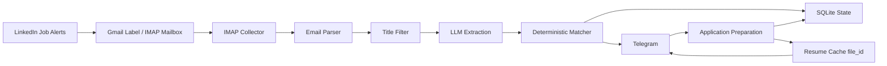

# Architecture

Job Applier is a local automation pipeline with deterministic matching at its core.

## High-Level Diagram

## Core Components

- `app/collectors/email_imap_client.py`: IMAP connectivity and mailbox operations.
- `app/collectors/linkedin_email_parser.py`: extracts vacancy cards from LinkedIn alert emails.
- `app/vacancy_analyzer.py`: orchestrates extraction + deterministic matching.
- `app/llm_client.py`: LLM API client for structured extraction and cover letters.
- `app/storage/seen_jobs.py`: deduplication state for collected vacancies.
- `app/storage/telegram_delivery.py`: Telegram delivery lifecycle and queue state.
- `telegram_resume_cache` table: resume metadata and Telegram reusable `file_id`.
- `application_history` table: compact lifecycle timestamps and current status.
- `app/telegram/client.py`: Telegram API integration and callback transport.
- `app/application/preparation_service.py`: preparation package orchestration.
- `app/application/resume_cache_service.py`: resume cache hit/miss detection and upload/reuse.
- `app/cli.py`: command layer and background `run` loop orchestration.

## Decision Model

1. LLM extracts structured vacancy facts.
2. Deterministic Python matcher compares extracted requirements with candidate profile/skills.
3. Final decision is one of:
   - `STRONG_MATCH`
   - `POTENTIAL_MATCH`
   - `IGNORE`

The LLM does not make the final score decision.

## Persistence

SQLite stores operational metadata:

- seen job IDs
- Telegram delivery statuses
- preparation metadata
- Telegram update offset
- resume cache metadata (`file_id`, size, mtime)

SQLite does not store full email bodies or cover letter text as a durable history table.

## Runtime Mode

`uv run python -m app run` runs:

- periodic LinkedIn collection + Telegram delivery cycle;
- short interval callback polling;
- automatic preparation when `PREPARE_REQUESTED` appears.
