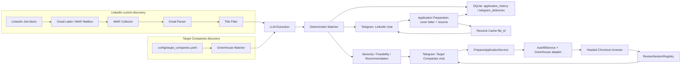

# Architecture

Job Applier is a local automation pipeline with deterministic matching and deterministic field-filling at its core. There are two parallel discovery paths (LinkedIn email, Target Companies Greenhouse) sharing analysis and storage primitives, plus two distinct "prepare" mechanisms (LinkedIn cover-letter/resume package, Target Company Greenhouse browser autofill).

## High-Level Diagram

```mermaid
flowchart LR
    subgraph LinkedIn current discovery
        A[LinkedIn Job Alerts] --> B[Gmail Label / IMAP Mailbox]
        B --> C[IMAP Collector]
        C --> D[Email Parser]
        D --> E[Title Filter]
    end
    subgraph Target Companies discovery
        TC[config/target_companies.yaml] --> TW[Greenhouse Watcher]
    end
    E --> F[LLM Extraction]
    TW --> F
    F --> G[Deterministic Matcher]
    G --> RC[Seniority / Feasibility / Recommendation]
    G --> H[SQLite: application_history / telegram_deliveries]
    G --> I1[Telegram: LinkedIn chat]
    RC --> I2[Telegram: Target Companies chat]
    I1 --> J[Application Preparation: cover letter + resume]
    J --> K[Resume Cache file_id]
    K --> I1
    J --> H
    I2 --> P[PrepareApplicationService]
    P --> AF[AutofillService + Greenhouse adapter]
    AF --> BR[Headed Chromium browser]
    BR --> RS[ReviewSessionRegistry]
    RS --> I2
```

The LLM extracts structured vacancy facts and drafts cover letters (LinkedIn `PreparationService`, and Target Company Greenhouse autofill via `AutofillCoverLetterProvider`); it may also generate optional answers for unknown Greenhouse custom questions, always flagged for review. Final matching, seniority/feasibility/recommendation, and known-field question-mapping/classification are deterministic Python — but not every field an autofill run places into the form is deterministic, since cover letter text and generated custom-question answers are LLM output. The LLM is never the final decision-maker and no code path clicks a Submit control.

## Core Components

### Discovery

- `app/collectors/email_imap_client.py`: IMAP connectivity and mailbox operations for LinkedIn Job Alert emails.
- `app/collectors/linkedin_email_parser.py`: extracts vacancy cards from LinkedIn alert emails.
- `app/collectors/greenhouse_collector.py`: shared Greenhouse HTTP helpers (`build_greenhouse_http_client`, `fetch_greenhouse_board_jobs`, `greenhouse_job_to_normalized`) plus a generic collector (`source=greenhouse`, `GREENHOUSE_BOARDS`) delivered through the LinkedIn/current-discovery Telegram destination — this is separate from Target Companies.
- `app/company_watch/`: Target Companies config loading (`config/target_companies.yaml`), the Greenhouse watcher (reuses the collector's shared HTTP helpers), title prefilter, per-company error isolation, and standalone Lever/Ashby/SmartRecruiters watcher modules (`app/company_watch/watchers/`) that exist but are **not called from `run` or Telegram**. Workday has no watcher.

### Analysis

- `app/vacancy_analyzer.py`: orchestrates LLM extraction + deterministic matching for every source.
- `app/llm_client.py`: LLM API client for structured extraction and cover-letter generation.
- `app/requirement_matcher.py`, `app/title_rules.py`: deterministic scoring/decision logic.
- `app/company_watch/`: seniority classification, feasibility assessment, and the `APPLY_NOW` / `CHECK_MANUALLY` / `SKIP` application recommendation (Target Companies only). `data/target_company_analysis_cache.json` caches analysis results (durable JSON, not SQLite).

## Decision Model

1. LLM extracts structured vacancy facts.
2. Deterministic Python matcher compares extracted requirements with candidate profile/skills.
3. Final decision is one of:
   - `STRONG_MATCH`
   - `POTENTIAL_MATCH`
   - `IGNORE`
4. Target Companies vacancies additionally get a deterministic seniority + feasibility pass and an `APPLY_NOW` / `CHECK_MANUALLY` / `SKIP` recommendation (`app/company_watch/application_recommendation.py`). `allows_autonomous_application_workflow` gates Telegram *delivery* (`APPLY_NOW` + `CHECK_MANUALLY`); it is a separate, looser gate than the prepare/autofill gate below.

The LLM does not make the final score, recommendation, or field-fill decision.

## Telegram

- `app/telegram/client.py`: Telegram Bot API integration, card/button construction, callback transport. `source_supports_prepare` (LinkedIn) and `source_supports_application_prepare` (Target Company Greenhouse) select which button a card gets; every card also gets `✅ Applied` / `⏭ Skip` / `🔗 Open vacancy`.
- `app/telegram/destinations.py`: `TelegramDestination.LINKEDIN` vs `TelegramDestination.TARGET_COMPANIES`, resolved from `TELEGRAM__LINKEDIN_CHAT_ID` / `TELEGRAM__TARGET_COMPANIES_CHAT_ID` (legacy `TELEGRAM__CHAT_ID` falls back to LinkedIn only; flat `TELEGRAM_CHAT_ID`, without the nested-settings `__` delimiter, is not a `Settings` key). No silent fallback from Target Companies to LinkedIn; the code does not require `TELEGRAM__TARGET_COMPANIES_CHAT_ID` to differ from the LinkedIn chat id, only that it is set.
- `app/telegram/application_prepare.py`: formats Target Company Greenhouse prepare outcomes (starting/blocked/failed/completed text), maps a coded `AutofillFailureReason` to safe user-facing text (never raw exception text), and formats the "Done reviewing" callback response.

## Two Preparation Mechanisms

### A. LinkedIn preparation (`PreparationService`)

- `app/application/preparation_service.py`: generates a cover letter, selects a resume (LLM-assisted, falls back to a default profile), sends the package to the LinkedIn Telegram chat, updates `PREPARED` status.
- `app/application/resume_cache_service.py`: resume cache hit/miss detection and Telegram `file_id` upload/reuse.
- `application_answers` (custom-question generation for this path) is a no-op placeholder.
- This path never opens a browser and never touches an ATS directly.

### B. Target Company Greenhouse preparation → Stage 1 autofill

- `app/application/prepare_application.py` (`PrepareApplicationService`, `PrepareIntent.AUTONOMOUS` / `PrepareIntent.EXPLICIT`): gates on canonical application lifecycle (`APPLIED` blocks every intent) then on recommendation (`SKIP` always blocked; `CHECK_MANUALLY` only via `EXPLICIT`; `APPLY_NOW` allowed for both), then delegates to `AutofillService.run`. It does not import Playwright, the Greenhouse adapter, or the AutofillService class directly (only the `AutofillRunner` protocol).
- `app/application/autofill/resolver.py` (`DefaultVacancyResolver`): resolves `source + external_id` to a vacancy via a live Greenhouse board refetch (`target_company:greenhouse:<board>` only; generic `greenhouse`/LinkedIn/HH sources fail as unsupported). Application URL is the Greenhouse `absolute_url`.
- `app/application/autofill/browser.py` (`BrowserSession`): headed Playwright Chromium; `close()` is explicit, there is no `submit()` method anywhere in the adapter surface.
- `app/application/autofill/greenhouse.py` (`GreenhouseAdapter`): recognizes Greenhouse-style forms, detects CAPTCHA/Cloudflare/login challenges (`NEEDS_MANUAL_INTERVENTION`, no bypass), discovers fields, fills/reads back text/select/radio/checkbox/React controls and file uploads, and handles Greenhouse's React-based multi-select/cover-letter editor with wait-then-read-back verification (`app/application/autofill/react_controls.py`).
- `app/application/autofill/classifier.py`, `questions.py`, `options.py`, `phone.py`, `acknowledgements.py`: map discovered fields to explicit `CandidateProfile`/`ApplicationPolicy` facts only (no LLM, no inference from location/relocation into citizenship or authorization); classify into `SUPPORTED_DETERMINISTIC` / `UNKNOWN_REQUIRED` / `UNKNOWN_OPTIONAL` / `SENSITIVE_OPTIONAL` / `UNSUPPORTED`. Sensitive/demographic fields stay unfilled by default. Gender is a specific case, not an example of an explicit-value override: `_gender_value` never reads `sensitive.gender` at all — a required Gender field always gets a non-disclosure option, an optional Gender field is always left untouched, regardless of what the profile contains.
- `app/application/autofill/resume.py`: resolves the resume file from the Candidate Profile's `default_resume` path.
- `app/application/autofill/cover_letter.py`, `answers.py`: reuse the existing LLM cover-letter generation path; optional generated answers for unknown custom questions are always marked `generated` and treated as needing review, never as deterministic/auto-submittable.
- `app/application/autofill/service.py` (`AutofillService.run`): orchestrates resolve → profile load → resume resolve → browser open → adapter discover/classify/fill/read-back → result. It builds the result via the `stage1_autofill_result` factory, which discards any caller-supplied `submit_performed` and hardcodes `False`; `Stage1AutofillResult`'s validator separately coerces `True` back to `False`. The plain `AutofillResult` model has no such guard on its own — production Stage 1 never constructs one directly, so `submit_performed` is `False` in practice, but that is a factory/subclass guarantee, not an inherent property of the model. On success/manual-intervention with `keep_open=True`, it calls the optional `on_ready(result)` hook (wrapped in try/except so a failed notification — e.g. a transient Telegram send error — cannot skip the browser handoff) and then blocks in `complete_browser_handoff` until `wait_for_review()` returns.
- `app/application/autofill/review_session.py` (`ReviewSessionRegistry`): Telegram/ATS-agnostic per-run session registry (`register` / `wait_for_done` / `mark_done` / `discard` / `close_all` / `wait_all_discarded`), used only by the Telegram-triggered path.
- Two different browser handoffs by design, both explicit and neither ever auto-closing on a timer:
  - **Diagnostic CLI** (`uv run python -m app autofill SOURCE EXTERNAL_ID`, `app/application/autofill/cli.py`): ungated (does not call `PrepareApplicationService`, does not check recommendation or `APPLIED`), blocks on builtin `input()` on the terminal until Enter/Ctrl+C.
  - **Telegram-triggered path** (`app/cli.py::_dispatch_target_company_application_prepare`): registers a `ReviewSessionRegistry` session, sends a completion message with a **"Done reviewing"** button (`revdone:<session_id>`) once the browser is open and filled, and blocks on `registry.wait_for_done(session_id)`. `_handle_review_done_callback` closes only that session's browser. A duplicate/unknown/already-closed tap answers gracefully (`ALREADY_CLOSED` / `NOT_FOUND`) instead of erroring or hanging. `run` shutdown calls `close_all()` then `wait_all_discarded(timeout=10s)` as best-effort cleanup.
  - **Known open gap:** if the Telegram send inside `on_ready` fails, the browser handoff and registry entry are correctly kept alive (per the fix above), but the "Done reviewing" button/message never reaches the user and there is no retry before the wait begins. The session is then only released by a delivered "Done reviewing" tap or by `close_all()` at process shutdown — manually closing the Chromium window does not call `registry.mark_done` and does not release `wait_for_review()`; the worker thread stays blocked regardless. Not designed or fixed here.
- "Done reviewing" (or terminal Enter/Ctrl+C) only closes the browser session; it never clicks Submit and never writes any lifecycle status. `✅ Applied` is a separate, manual Telegram card action the user presses after they submit and confirm in the browser themselves; the app never infers `APPLIED` from autofill/read-back and never verifies against the ATS that a submission occurred.

## Persistence

SQLite (`data/jobs.db`) stores operational metadata, shared by both discovery paths where the schema is keyed by `(source, external_id)`:

| Store | Key | Role |
|---|---|---|
| `application_history` | `(source, external_id)` | Canonical application lifecycle: `FOUND` / `SENT` / `PREPARED` / `APPLIED` / `SKIPPED` plus timestamps. `PrepareApplicationService` reads this; only `APPLIED` blocks prepare/autofill. |
| `telegram_deliveries` | `(source, external_id, chat_id)` | Telegram card UI/delivery status. |
| `application_preparations` | `(source, external_id)` | LinkedIn prepare-package artifacts (cover letter paths, aux message ids). |
| `vacancy_prepare_cache` | `(source, external_id)` | Analysis snapshot for LinkedIn prepare. |
| `seen_jobs` | `(source, external_id)` | Collection dedup only; not application status. |
| `telegram_resume_cache` | resume profile id | Reusable Telegram `file_id`, size/mtime for cache invalidation. |

`data/target_company_analysis_cache.json` (not SQLite) caches Target Companies analysis by vacancy identity, read by the Telegram prepare path via `TargetCompanyAnalysisCache.get_by_identity`.

`data/prepared/` (LinkedIn cover-letter artifacts) has an age-based retention rule; durable resume PDFs under `resumes/` are never touched by it.

SQLite does not store full email bodies, cover letter text, or Greenhouse form contents as a durable history table. Autofill does not persist a `READY_FOR_REVIEW`/`PREPARED` Greenhouse-specific row anywhere — the `AutofillResult` is transient, only surfaced in the CLI/Telegram summary and logs.

## Runtime Mode

`uv run python -m app run` runs:

- periodic LinkedIn + Target Companies collection/analysis cycle on `PIPELINE_INTERVAL_SECONDS` (Target Companies only delivers when `TELEGRAM__TARGET_COMPANIES_CHAT_ID` is set; HH is not part of this loop);
- short-interval Telegram callback polling on `TELEGRAM_POLL_INTERVAL_SECONDS`, including `revdone:` "Done reviewing" callbacks;
- automatic LinkedIn preparation when `PREPARE_REQUESTED` appears;
- Target Company Greenhouse "Prepare application" taps, run in a background thread per request, opening a real headed browser (Playwright is imported lazily so normal collection/analysis does not require it);
- best-effort shutdown cleanup of any still-open review sessions.
